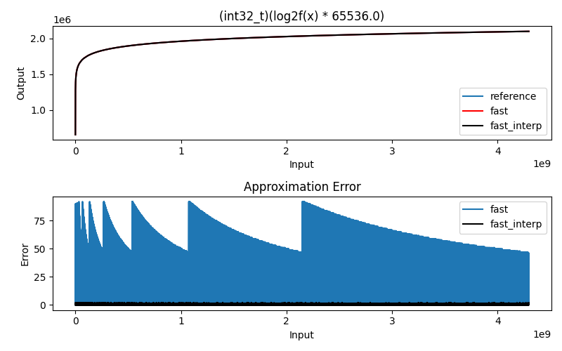

## What?

Calculates $$log_2$$ of an unsigned 32 bit integer value with 16bit fraction outputs. (*Q16 format*)

This algorithm doesn't use any division, loop or branch instructions which makes it fast and constant run time. However, this algorithm heavily relies on $$CLZ$$ instruction commonly found on desktop / laptop / mobile grade CPUs and ARM Cortex M3, M4, M7 cores.

## Input / Output range

* Input must be greater than $$0$$ and must be smaller than $$(2^{32} - 1)$$
* Output is between $$0$$ and $$((32 * 65536) - 1)$$

## Reference Implementation

```c
int32_t log2_reference(uint32_t x)
{
  return (int32_t)(log2f(x) * 65536.0);
}
```

## Fundamentals

We are using the following logarithmic identity:

$$log_2(a+b) = \log_2(a) + log_2(1+\frac{b}{a})$$

Based on this identiy, we seperate the input value $$x$$ into $$a$$ and $$b$$ values where 

* $$a$$ holds the highest $$2^N$$ value smaller or equal to $$x$$
* $$b$$ is ($$x$$ - $$a$$)

After this part, 

* $$log_2(a)$$ can be calculated as $$N$$ directly 
* A lookup table can be used for calculating the $$log_2(1+\frac{b}{a})$$ part

## Why CLZ is useful?

This core instruction calculates *the number of leading zeros in a number in binary form*. 

Given the following 32-bit number:

	0000 0000 0001 0001 1010 0100 0000 1000

... $$CLZ$$ instruction returns $$11$$

Then, we calculate the locaction of the left-most non zero bit as:

$$31 - CLZ(x)$$

Which is equal to the $$N$$ in the highest $$2^N$$ value smaller or equal to input $$x$$

## Core Algorithm

```c
int32_t log2_fast(uint32_t x)
{ 
  // ...  
  uint32_t xlz = __builtin_clz(x);
  uint32_t xbits = 31 - xlz;
  uint32_t xremainder = x & ~(1 << xbits);
  uint32_t xremainder_big = xremainder << xlz;

  // ...
  uint32_t result = 0;
  result += (xbits << 16);
  result += lutRead(xremainder_big);
  return result;  
}
```

## Error analysis



* In this particular example, 1024 length lookup table is used.
* Size of the lookup table can be increased for reduced error performance. Or, table can be read with linear interpolation for reduced error performance.
	- Maximum error over whole 32bit input range with 1024 length table is `92 / 65536`	
	-  Maximum error over whole 32bit input range with 1024 length table + 16bit interpolation is `2 / 65536`

## Implementation

* `./scripts/lutgen_log2.py` for lookup table generation.
* `main.c` for the *fast* and *fast & interpolated* version of the algorithm.

## Licence

```
// ----------------------------------------------------------------------------
// MIT License
// 
// Copyright (c) 2022 <ihsan@kehribar.me>
// 
// Permission is hereby granted, free of charge, to any person obtaining a 
// copy of this software and associated documentation files (the "Software"), 
// to dealin the Software without restriction, including without limitation 
// the rights to use, copy, modify, merge, publish, distribute, sublicense, 
// and/or sell copies of the Software, and to permit persons to whom the 
// Software is furnished to do so, subject to the following conditions:
// 
// The above copyright notice and this permission notice shall be included in 
// all copies or substantial portions of the Software.
// 
// THE SOFTWARE IS PROVIDED "AS IS", WITHOUT WARRANTY OF ANY KIND, EXPRESS OR
// IMPLIED, INCLUDING BUT NOT LIMITED TO THE WARRANTIES OF MERCHANTABILITY,
// FITNESS FOR A PARTICULAR PURPOSE AND NONINFRINGEMENT. IN NO EVENT SHALL THE
// AUTHORS OR COPYRIGHT HOLDERS BE LIABLE FOR ANY CLAIM, DAMAGES OR OTHER
// LIABILITY, WHETHER IN AN ACTION OF CONTRACT, TORT OR OTHERWISE, ARISING 
// FROM, OUT OF OR IN CONNECTION WITH THE SOFTWARE OR THE USE OR OTHER DEALINGS 
// IN THE SOFTWARE.
// ----------------------------------------------------------------------------```