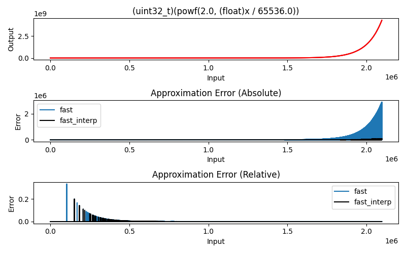

## What?

Calculates 2<sup>x</sup> where x is Q16 format fixed point number. 

## Input / Output range

* Input must be between 0 and ((32 * 65536) - 1)
* Output is greater than 0 and smaller than (2<sup>32</sup> - 1)

## Error analysis



* In this particular example, 1024 length lookup table is used.
* Relative error statistics:
	- mean: *0.000328* 
	- stddev: *0.002606* 
	- variance: *0.000007*

## Licence

```
// ----------------------------------------------------------------------------
// MIT License
// 
// Copyright (c) 2022 <ihsan@kehribar.me>
// 
// Permission is hereby granted, free of charge, to any person obtaining a 
// copy of this software and associated documentation files (the "Software"), 
// to dealin the Software without restriction, including without limitation 
// the rights to use, copy, modify, merge, publish, distribute, sublicense, 
// and/or sell copies of the Software, and to permit persons to whom the 
// Software is furnished to do so, subject to the following conditions:
// 
// The above copyright notice and this permission notice shall be included in 
// all copies or substantial portions of the Software.
// 
// THE SOFTWARE IS PROVIDED "AS IS", WITHOUT WARRANTY OF ANY KIND, EXPRESS OR
// IMPLIED, INCLUDING BUT NOT LIMITED TO THE WARRANTIES OF MERCHANTABILITY,
// FITNESS FOR A PARTICULAR PURPOSE AND NONINFRINGEMENT. IN NO EVENT SHALL THE
// AUTHORS OR COPYRIGHT HOLDERS BE LIABLE FOR ANY CLAIM, DAMAGES OR OTHER
// LIABILITY, WHETHER IN AN ACTION OF CONTRACT, TORT OR OTHERWISE, ARISING 
// FROM, OUT OF OR IN CONNECTION WITH THE SOFTWARE OR THE USE OR OTHER DEALINGS 
// IN THE SOFTWARE.
// ----------------------------------------------------------------------------```